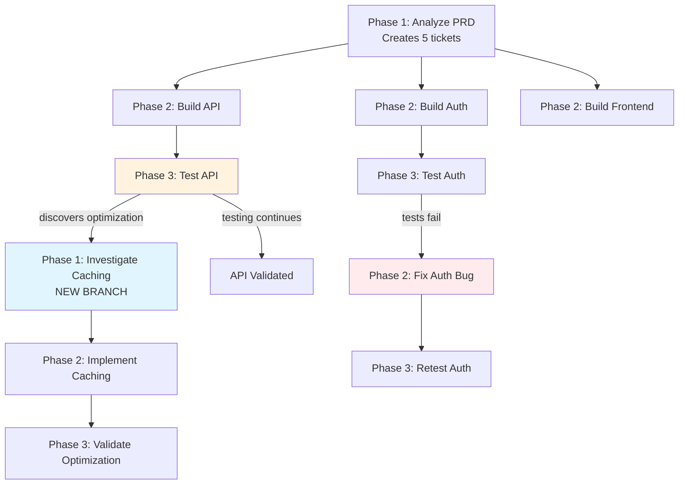

# 🔥 Hephaestus: A Semi-Structured Agentic Framework

<div align="center">


**What if AI workflows could write their own instructions as agents discover what needs to be done?**

[Quick Start](https://ido-levi.github.io/Hephaestus/docs/getting-started/quick-start) • [Documentation](https://ido-levi.github.io/Hephaestus/) • [Examples](example_workflows/) • [Join our discord](https://discord.gg/FMCJeKG3dU) • [Hephaestus Dev](https://ido-levi.github.io/Hephaestus/docs/getting-started/hephaestus-dev)

</div>

---

## 🎥 See Hephaestus in Action

<div align="center">

https://github.com/user-attachments/assets/7b021611-2c09-494b-9da1-2ce05176dc51

*Watch how Hephaestus coordinates multiple AI agents, monitors their trajectories, and builds workflows dynamically*

</div>

---

## NEW: Hephaestus Dev

**Ready to use Hephaestus as a development tool?** We've built **Hephaestus Dev** - a pre-configured setup with 5 production-ready workflows for software development:

| Workflow | What it does |
|----------|--------------|
| **PRD to Software Builder** | Build complete software from a Product Requirements Document |
| **Bug Fix** | Analyze, fix, and verify bugs systematically |
| **Index Repository** | Scan and index a codebase to build knowledge in memory |
| **Feature Development** | Add features to existing codebases following patterns |
| **Documentation Generation** | Generate comprehensive docs for existing codebases |

```bash
python run_hephaestus_dev.py --path /path/to/project
```

**[Get started with Hephaestus Dev →](https://ido-levi.github.io/Hephaestus/docs/getting-started/hephaestus-dev)**

---

## The Problem I Kept Running Into

I was trying to build a system where AI agents could handle complex software projects. You know the kind: "Build me an authentication system with OAuth, JWT, rate limiting, and comprehensive tests."

Traditional agentic frameworks can branch and loop, but they have a limitation: **every branch needs predefined instructions.** You must write the task descriptions upfront for every scenario you anticipate.

But what about discoveries you didn't anticipate? When a testing agent finds an optimization opportunity, a security issue, or a better architectural pattern?

Here's what I tried instead: **Define logical phase types that are needed to solve problems - like "Plan → Implement → Test" - and let agents create tasks in ANY phase based on what they discover.**

## What Actually Happened: A Branching Tree That Builds Itself

Instead of a rigid sequence, I set up phase types:
- **Phase 1 (Analysis)**: Understanding, planning, investigation
- **Phase 2 (Implementation)**: Building, fixing, optimizing
- **Phase 3 (Validation)**: Testing, verification, quality checks

The key insight: **Agents can spawn tasks in any phase they want.**

A validation agent testing your auth system might discover an elegant caching pattern. Instead of being stuck (or following predefined branching logic you wrote), the agent:

1. **Creates a Phase 1 investigation task**: "Analyze auth caching pattern - could apply to 12 other API routes for 40% speedup"
2. **Keeps working** on their validation task
3. Another agent picks up the investigation task and explores it

The workflow just branched itself. Not because you predicted "if optimization found, spawn investigation task" - but because the agent discovered something worth exploring and had the freedom to create work for it.

This creates a **branching tree of tasks** that grows based on actual discoveries, not anticipated scenarios.

Let me show you what this looks like in practice:

### Example: Building from a PRD

I give Hephaestus a product requirements document: "Build a web application with authentication, REST API, and a React frontend."

**Phase 1 agent** reads the PRD and identifies 5 major components:
1. Authentication system
2. REST API layer
3. React frontend
4. Database schema
5. Background workers

It spawns **5 Phase 2 tasks** — one for each component. Now I have 5 agents building in parallel, each focused on one piece.

One of the **Phase 2 agents** finishes the REST API and spawns a **Phase 3 validation task**: "Test the REST API endpoints."

The **Phase 3 agent** starts testing. Everything passes. But then it notices something:

> "The auth endpoints use a caching pattern that reduces database queries by 60%. This could speed up all API routes significantly."

**Here's where it gets interesting.**

The Phase 3 agent doesn't just log this observation and move on. It doesn't get stuck because there's no "investigate optimizations" in the workflow plan.

Instead, it **spawns a new Phase 1 investigation task**: "Analyze auth caching pattern — could apply to other API routes for major performance gain."

<div align="center">

<p><em>Real-time view: 2 agents working across 3 phases, Guardian monitoring at 90% coherence</em></p>
</div>

A new Phase 1 agent spawns, investigates the caching pattern, confirms it's viable, and spawns a **Phase 2 implementation task**: "Apply caching pattern to all API routes."

Another agent implements it. Another agent validates it.

**The workflow just branched itself.** No one planned for this optimization. An agent discovered it during testing and created new work to explore it.

Meanwhile, a different Phase 3 agent is testing the authentication component. Tests fail. So it spawns a **Phase 2 bug fix task**: "Fix auth token expiry validation — current implementation allows expired tokens."

The fix agent implements the solution and spawns **Phase 3 retest**: "Validate auth fixes."

### What Just Happened?

Look at what emerged:



**This workflow built itself:**
- Started with 1 analysis task
- Branched into 5 parallel implementation tasks
- One testing phase discovered optimization → spawned 3-phase investigation branch
- Another testing phase found bugs → spawned fix → retest loop
- All coordinated through Kanban tickets with blocking relationships

<div align="center">

<p><em>Kanban board automatically built by agents: Backlog → Building → Testing → Done</em></p>
</div>

<div align="center">

<p><em>Dependency graph showing which tickets block others - the workflow structure Hephaestus discovered</em></p>
</div>

## Why This Changes Everything

**Traditional workflows:** Predict every scenario upfront → rigid plan → breaks when reality diverges

**Hephaestus approach:** Define work types → agents discover → workflow adapts in real-time

The workflow adapts in real-time based on what agents actually discover, not what we predicted upfront.

## The Semi-Structured Sweet Spot

Here's why this is "semi-structured" and why that matters:

**Fully structured workflows** (traditional frameworks):
- ❌ Require predefined prompts for every scenario
- ❌ Can branch/loop, but need fixed instructions for each path
- ❌ Must anticipate all discoveries upfront

**Fully unstructured agents** (chaos):
- ❌ No coordination
- ❌ Duplicate work
- ❌ Contradictory changes
- ❌ No clear success criteria

**Semi-structured (Hephaestus)**:
- ✅ **Phase definitions** provide work type structure and guidelines
- ✅ **Agents write task descriptions** dynamically based on discoveries
- ✅ **Kanban tickets** coordinate work with blocking relationships
- ✅ **Guardian monitoring** ensures agents stay aligned with phase goals
- ✅ Workflow adapts to what agents actually find, not what you predicted

You get **structure where it matters**:
- Phase types define what kind of work is happening
- Done definitions set clear completion criteria
- Guardian validates alignment with phase instructions
- Tickets track dependencies and prevent chaos

And **flexibility where you need it**:
- Agents create detailed task descriptions on the fly
- No need to predefine every possible branch
- Discoveries drive workflow expansion in real-time
- New work types emerge as agents explore

## 🚀 Quick Start

### Prerequisites

- **Python 3.10+**
- **tmux** - Terminal multiplexer for agent isolation
- **Git** - Your project must be a git repository
- **Docker** - For running Qdrant vector store
- **Node.js & npm** - For the frontend UI
- **Claude Code**, **OpenCode**, **Droid**, or **Codex** - CLI AI tool that agents run inside
- **API Keys**: OpenAI, OpenRouter, Anthropic (also supports: Azure OpenAI, Google AI Studio - see [LLM Configuration](https://ido-levi.github.io/Hephaestus/docs/getting-started/quick-start#llm-configuration))

### Validate Your Setup (macOS)

Before starting, validate that everything is installed and configured correctly:

```bash
python check_setup_macos.py
```

This script checks:
- ✅ All required CLI tools (tmux, git, docker, node, npm, Claude Code)
- ✅ API keys in `.env` file
- ✅ MCP servers configured
- ✅ Configuration files and working directory
- ✅ Running services (Docker, Qdrant)
- ✅ Python and frontend dependencies

The script provides a color-coded report showing what's set up and what needs attention.

### Get Started in 10 Minutes

Build your first self-adapting workflow:

**👉 [Quick Start Guide](https://ido-levi.github.io/Hephaestus/docs/getting-started/quick-start)**

The guide walks you through:
- Setting up API keys and LLM configuration
- Configuring MCP servers (Hephaestus + Qdrant)
- Setting your working directory
- Defining phases with dynamic task generation
- Running a workflow that adapts in real-time
- Watching agents coordinate and discover new work automatically

<div align="center">

<p><em>Real-time observability: Watch agents work in isolated Claude Code sessions as they discover and build the workflow</em></p>
</div>

---

**Want to learn more?** Check out the [full documentation](https://ido-levi.github.io/Hephaestus/) for:
- Complete architecture and technical details
- API reference and SDK guides
- Example workflows and templates
- Best practices and advanced features

---

## 🤝 Getting Help

- 📖 **[Documentation](https://ido-levi.github.io/Hephaestus/)** - Complete guides, API reference, and tutorials
- 💬 **[GitHub Discussions](https://github.com/Ido-Levi/Hephaestus/discussions)** - Ask questions and share ideas
- 🐛 **[Issue Tracker](https://github.com/Ido-Levi/Hephaestus/issues)** - Report bugs and request features
- 📧 **Email** - Reach out for support or collaboration

---

<div align="center">

**Hephaestus: Where workflows forge themselves**

*Named after the Greek god of the forge, Hephaestus creates a system where agents craft the workflow as they work*

[Quick Start](https://ido-levi.github.io/Hephaestus/docs/getting-started/quick-start) • [Documentation](https://ido-levi.github.io/Hephaestus/)

**License:** AGPL-3.0 • **Status:** Alpha - Active Development

</div>
